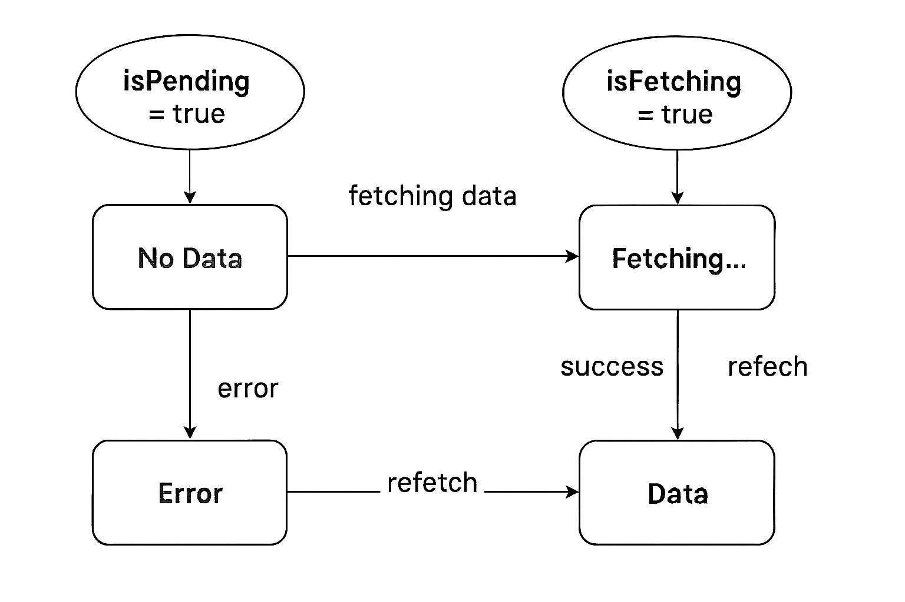

簡單比喻一句話
- isPending = 「還沒上桌」  
- isFetching = 「廚房正在煮，不管桌上有沒有菜


```
import { useQuery } from '@tanstack/react-query'
import axios from 'axios'

function UserList() {
  const { data, error, isPending, isError, isSuccess, isFetching } = useQuery({
    queryKey: ['users'],
    queryFn: async () => {
      const res = await axios.get('/api/users')
      return res.data
    },
  })

  if (isPending) {
    return <div>載入中...</div>
  }

  if (isError) {
    return <div>發生錯誤: {error.message}</div>
  }

  if (isSuccess) {
    return (
      <div>
        <h2>使用者列表</h2>
        <ul>
          {data.map((user: any) => (
            <li key={user.id}>{user.name}</li>
          ))}
        </ul>
        {isFetching && <p>正在更新資料...</p>}
      </div>
    )
  }

  return null
}
```
